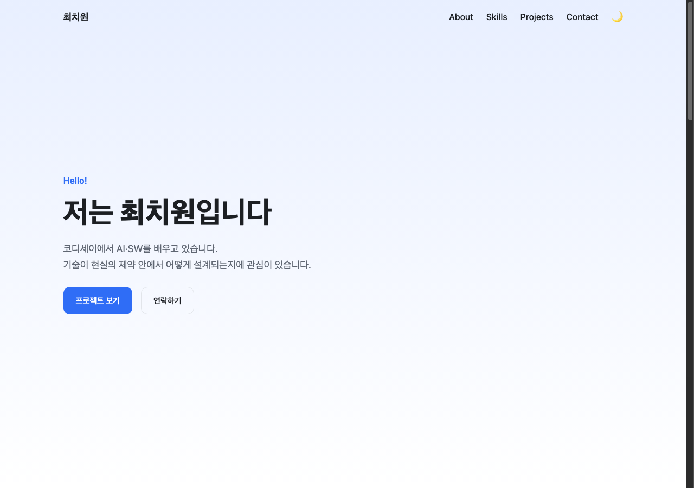
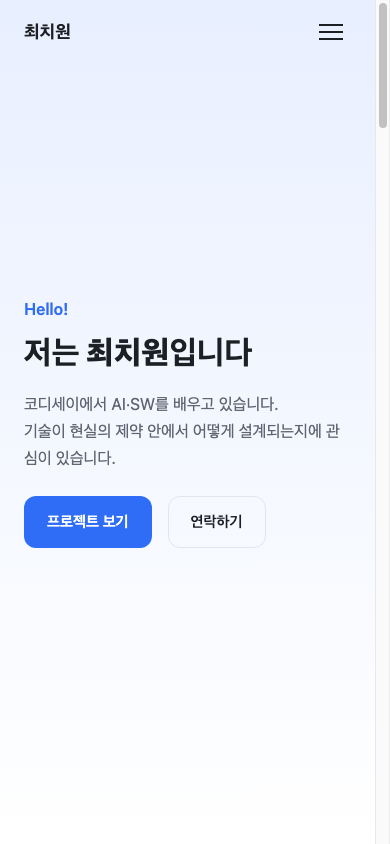
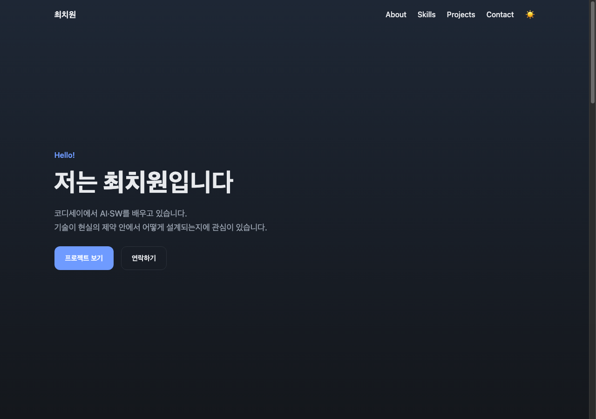

# 나를 소개하는 웹페이지

코디세이 AI/SW 기초 · 웹 기초와 프론트엔드 미션 1.

외부 라이브러리 없이 HTML, CSS, JavaScript만으로 만든 반응형 포트폴리오 사이트입니다.
GitHub API로 제 저장소 목록을 가져와 Projects 섹션에 보여줍니다.

## 배포 주소

https://dangchame.github.io/mission1_portfolio/

## 화면

| 데스크톱 | 모바일 | 다크 모드 |
|---|---|---|
|  |  |  |

## 사용 기술

- HTML — 시맨틱 태그로 구조 작성
- CSS — CSS 변수, Flexbox, Grid, 미디어 쿼리
- JavaScript — DOM 조작, 이벤트, Fetch API, Intersection Observer, 로컬스토리지
- GitHub Pages — 배포

프레임워크와 CSS 라이브러리는 쓰지 않았습니다. 아이콘 대신 이모지를 썼습니다.

## 폴더 구조

```
index.html          페이지 한 장
css/style.css       스타일 전체
js/state.js         상태 객체와 기준값
js/theme.js         다크 모드
js/nav.js           햄버거 메뉴, 스크롤 관련 동작
js/projects.js      GitHub API, 프로젝트 카드, 언어 필터
js/form.js          문의 폼 검증
js/animate.js       스크롤 애니메이션
images/             프로필 이미지
screenshots/        README에 쓰는 화면 사진
```

자바스크립트를 기능별로 나눈 이유는 파일 하나가 400줄을 넘어가면
어디를 고쳐야 하는지 찾기 어려워서입니다. HTML에서 `defer`로 순서대로 불러옵니다.

## 상태를 어떻게 다뤘는지

이 과제에서 제일 신경 쓴 부분입니다.

화면에서 달라질 수 있는 값은 전부 `js/state.js`의 `state` 객체 한 곳에 모았습니다.
그리고 규칙을 정했습니다.

1. `state`를 직접 고치는 것은 각 기능의 "상태 변경 함수"뿐이다
2. 상태를 고치면 반드시 그리는 함수를 부른다
3. 그리는 함수는 `state`만 보고 화면을 만든다

그래서 어떤 기능이든 코드가 세 덩어리로 나뉩니다.

```
이벤트 연결        addEventListener(...)  →  상태 변경 함수 호출
상태 변경 함수     state를 고치고         →  그리는 함수 호출
그리는 함수        state를 보고 화면을 맞춤
```

이렇게 하면 "지금 화면이 왜 이 모양인가"를 알고 싶을 때
DOM을 뒤지지 않고 `state`만 보면 됩니다.

### 상태 → 렌더링 흐름

| # | 이벤트 | 바뀌는 상태 | 화면 변화 |
|---|---|---|---|
| ① | 다크 모드 버튼 클릭 | `state.theme` | `html`의 `data-theme` 속성이 바뀌며 전체 색이 바뀜 |
| ② | 스크롤 | `state.scrolled`, `state.showToTop` | 네비 배경색, 맨 위로 버튼 표시 |
| ③ | 페이지 열림 / 다시 시도 | `state.projects.status` | 로딩 · 성공 · 에러 · 빈 화면 중 하나 |
| ④ | 언어 필터 클릭 | `state.filter` | 해당 언어 저장소만 보임 |
| ⑤ | 폼 입력 / 제출 | `state.form.errors` | 에러 메시지 표시·숨김 |

색을 바꿀 때 요소를 하나씩 고치지 않은 것도 같은 이유입니다.
`html` 태그의 `data-theme` 속성만 바꾸면 CSS의 `[data-theme="dark"]` 블록이 켜지면서
변수값이 통째로 바뀝니다. 자바스크립트는 속성 한 줄만 건드립니다.

## 구현한 기능

### 반응형

모바일 기준으로 먼저 작성하고, `min-width` 미디어 쿼리로 넓은 화면을 덧붙였습니다.

- 768px 이상 — 햄버거가 사라지고 메뉴가 한 줄로 펼쳐짐, About이 가로 배치, Skills 3열
- 1024px 이상 — 글자 크기와 섹션 여백을 키움

Projects 카드는 미디어 쿼리를 쓰지 않았습니다.
`repeat(auto-fit, minmax(260px, 1fr))` 으로 칸 최소 너비만 정해두면
화면 폭에 따라 열 개수가 알아서 바뀝니다.

### 인터랙션

| 기능 | 방식 |
|---|---|
| 햄버거 메뉴 | `classList.toggle('active', 조건)` 로 메뉴와 버튼에 동시에 적용 |
| 부드러운 스크롤 | CSS `scroll-behavior: smooth`. 헤더에 가려지지 않게 `scroll-padding-top` |
| 맨 위로 버튼 | 스크롤 **300px** 초과 시 표시 |
| 네비 배경색 | 스크롤 **60px** 초과 시 변경 |
| 다크 모드 | 로컬스토리지에 저장. 새로고침해도 유지 |
| 스크롤 애니메이션 | Intersection Observer, 임계값 **0.2** |

기준값 세 개(300px, 60px, 0.2)는 과제 기본값 그대로 두었습니다.
값은 `js/state.js` 위쪽에 상수로 모아뒀습니다.

`scroll` 이벤트는 한 번 굴릴 때마다 수십 번 발생합니다.
그래서 값이 실제로 바뀔 때만 화면을 다시 그리도록 했습니다.

스크롤 애니메이션에 Intersection Observer를 쓴 것도 같은 이유입니다.
`scroll` 이벤트로 위치를 계속 재는 대신, 화면에 들어오면 알려달라고 브라우저에 맡깁니다.
한 번 나타난 요소는 `unobserve`로 감시를 끊습니다.

### GitHub API

`https://api.github.com/users/DangChame/repos` 를 `fetch`와 `async/await`로 부릅니다.

네 가지 상태를 다 처리했습니다.

| 상태 | 화면 |
|---|---|
| 로딩 | 스피너와 "로딩 중..." |
| 성공 | 저장소 카드 목록 |
| 에러 | "프로젝트를 불러올 수 없습니다" + 다시 시도 버튼 |
| 빈 | "표시할 프로젝트가 없습니다" |

`fetch`는 404나 403을 받아도 실패로 치지 않습니다. 응답을 받긴 받았기 때문입니다.
그래서 `response.ok`를 직접 확인하고, 상태 코드별로 다른 메시지를 보여줍니다.

인증 없이 부르면 시간당 60회 제한이 있고 넘으면 403이 옵니다.
이 경우 "요청 한도를 넘었습니다"라고 안내합니다.

포크한 저장소는 제가 만든 게 아니라서 `filter`로 뺐습니다.

### 문의 폼

이름·이메일·메시지 모두 필수이고, 이메일은 형식까지 확인합니다.
에러 메시지는 각 입력창 바로 아래에 나오고, 문제가 있는 칸은 테두리가 빨개집니다.

제출하면 `preventDefault()`로 새로고침을 막고 성공 메시지를 보여줍니다.
실제로 메일이 가지는 않습니다.

한 번 제출해서 에러가 난 뒤에는 글자를 칠 때마다 다시 검사합니다.
고치는 중에도 빨간 글씨가 그대로 남아 있으면 답답해서입니다.

## 보너스 과제

- **프로젝트 필터링** — 언어별 버튼으로 저장소를 걸러냅니다. 언어 목록은 받아온 데이터에서 뽑아 만듭니다
- **시스템 다크 모드 감지** — 저장된 설정이 없으면 `prefers-color-scheme`로 운영체제 설정을 따라갑니다

## 지키려고 한 것

- `var`를 쓰지 않고 `const`, `let`만 씀
- HTML에 `onclick`을 쓰지 않고 `addEventListener`로 연결
- 인라인 스타일(`style="..."`)을 쓰지 않음
- 모든 이미지에 `alt`, 모든 입력창에 `label`의 `for`와 `id` 연결

`innerHTML`로 카드를 만들 때는 저장소 이름과 설명을 그대로 넣지 않고
한 번 걸러서 넣습니다. 설명에 `<`가 들어 있으면 태그로 해석되기 때문입니다.

## 로컬에서 보기

VS Code에서 Live Server 확장을 켜거나,

```
python3 -m http.server 8000
```

를 실행하고 `http://localhost:8000` 으로 들어가면 됩니다.

`index.html`을 파일로 바로 열어도 대부분 동작하지만,
그렇게 하면 주소가 `file://` 이라 GitHub API 요청이 막힐 수 있습니다.
